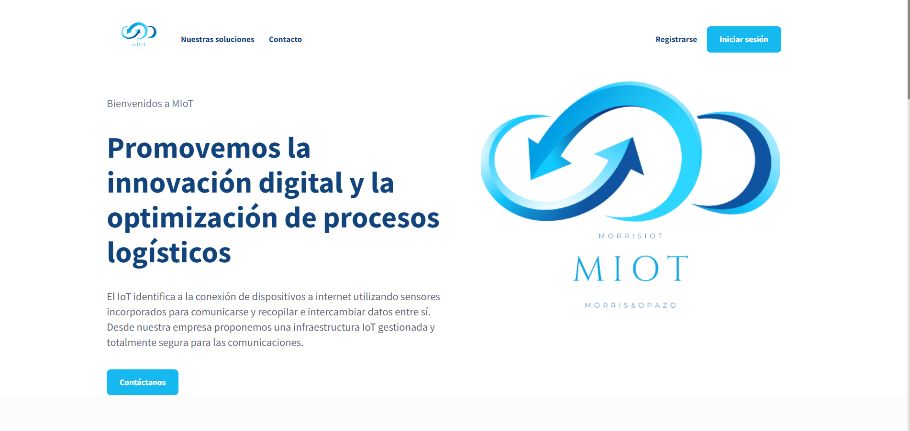
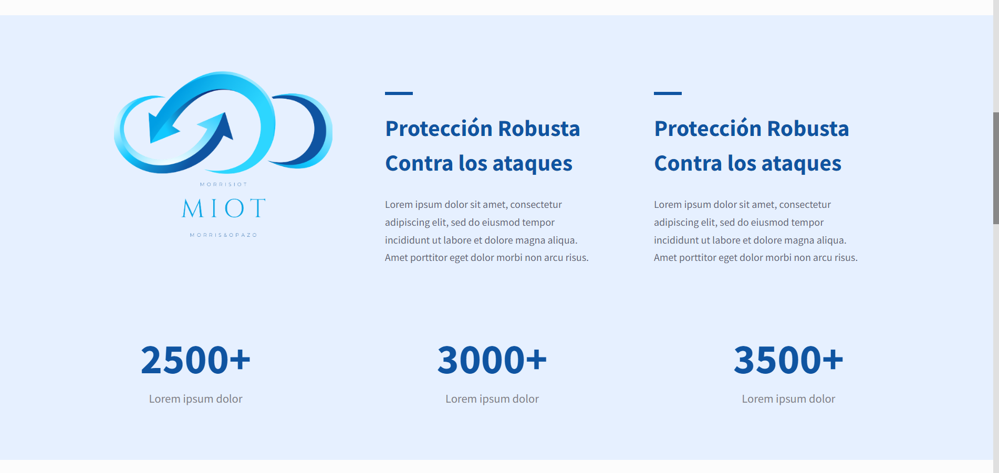
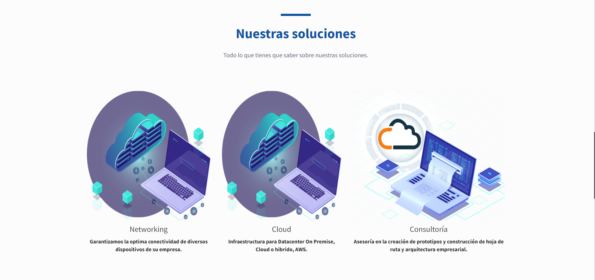
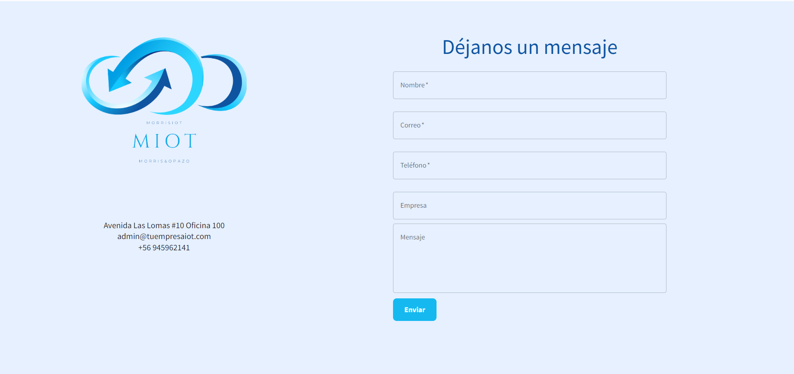
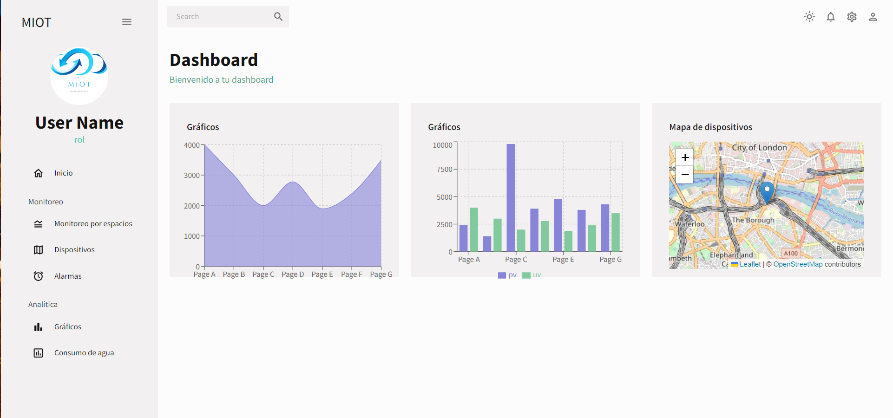
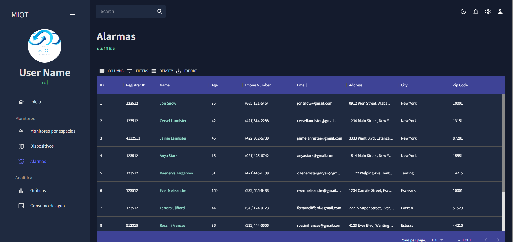

# smartbuildingbeta
Smartbuilding es un proyecto realizado para Morris &amp; Opazo. Es un IoT para un cliente de el area de la educacion superior  donde se requirió hacer una landing page y dashboards para el mantenimiento de los niveles de agua. Esto es solo una beta no el producto final.

Se utilizó React, Redux, TailwindCSS, leaflet, recharts, formik y yup. 

:point_right: [Live preview](https://646bfb45bb73ac0bdb420f9e--quiet-parfait-2a20cb.netlify.app/)

Imagen 1:

Imagen 2:

Imagen 3:

Imagen 4:

Imagen 5:

Imagen 6:

